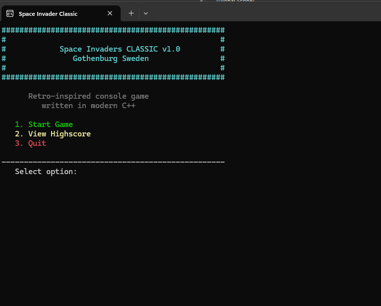
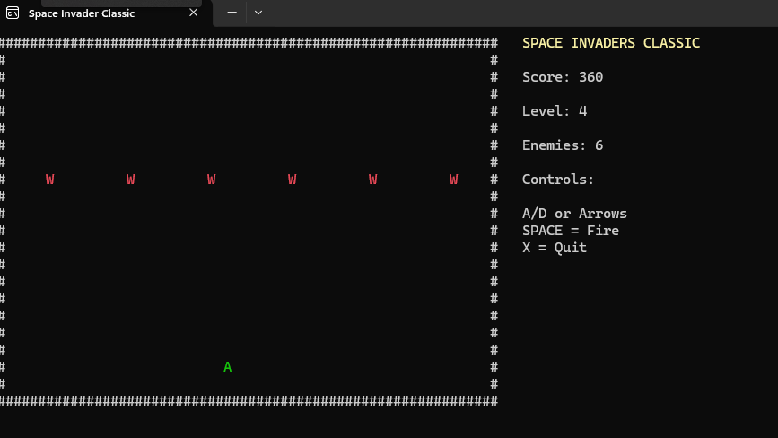
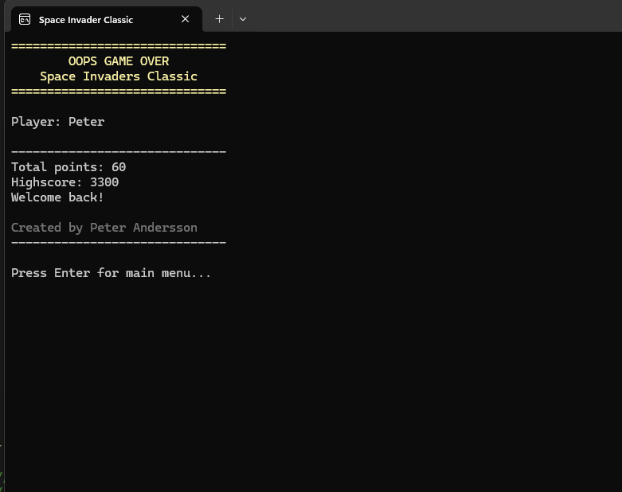

# Space Invaders Classic C++
Retro-inspired console shooter written in modern C++.

## Features
- Real-time movement
- Enemy wave system
- Local highscore system
- Retro sound and music
- Increasing difficulty
- ASCII/console graphics
- DOS-inspired UI

## About
Personal indie/hobby portfolio project built in modern C++.

## Credits
Background music from Pixabay Music.

Inspired by classic arcade games from the late 1970s and early 1980s.

## Screenshots

